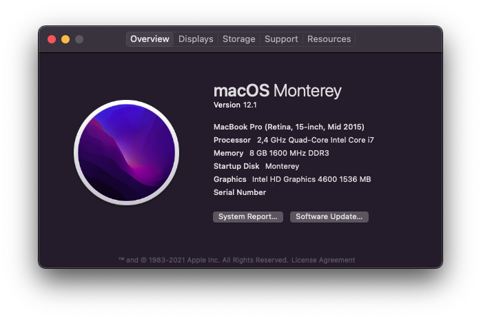

<h1 align="center">
   N550JV Hackintosh 
</h1>

Configuration files, that allow me to run macOS on my laptop. Based on [OpenCore](https://github.com/acidanthera/OpenCorePkg).

- OpenCore [0.8.4](https://github.com/acidanthera/OpenCorePkg/releases/tag/0.8.4)
- macOS Monterey 12.1

    

---

### **¡Disclaimer!**

The files are meant for my personal reference. I've also modified my laptop firmware which can potentially cause the laptop to become unaccessible.
 You are free to use and modify these files, but do so at your own risk 
Just because this works for me doesn't guarantee it will work for you.

---

I own an _ASUS N550JV-CN270H_, more specifically:
| Component | Description |
| --------: | :---------- |
| CPU | Intel Core i7 4700HQ (Haswell) |
| iGPU | Intel® HD Graphics 4600 |
| dGPU | Nvidia GeForce GT 750M |
| RAM | 8GB DDR3L 1600MHz |
| SSD | 850 Evo |
| ODD | populated with a HDD |
| WLAN & BT | DW 1550 (BCM94352HMB) |
| ETHERNET | RTL8168/8111 |
| AUDIO | ALC668 |

The subwoofer the laptop came with doesn't work and I haven't tried to make it work. I've replaced the optical drive with a hard drive to get more storage space. I've also replaced the default WiFi & BT card it came with as it was incompatible.

## What is working?

&#9745; Power management  
&#9745; iGPU[^1] (HDMI with audio[^2])  
&#9745; WiFi & Bluetooth  
&#9745; Battery read outs  
&#9745; Sleep  
&#9745; Audio[^3]  
&#9745; Touchpad with gestures  
&#9745; FN Keys  
&#9745; Keyboard backlight  
&#9745; Camera  
&#9745; USB3.0 Ports  
&#9745; Ethernet port  
&#9745; CFG register unlocked  
&#9745; NVRAM

&#9746; Nvidia dGPU (disabled as switchable graphics are not supported)  
&#9746; External subwoofer

? Card Reader ... _Detected as USB2.0-CRW, but not reading anything_  
? Mini Display Port ... _Untested, because I'm lazy_  
? iServices & Apple specifics (Handoff, AirPlay etc.) ... _Untested, because I do not own **actual** Apple products_

- Booting with an external display plugged in turns of the internal display, so during boot I keep any display cables unplugged.

[^1]: Booting with an external display plugged in turns of the internal display, so during boot I keep any display cables unplugged.
[^2]: While I have seen it working, it is inconsisent. No idea why.
[^3]: ~~The audio jack sometimes produces static noise. A restart fixes the issue. ~~ I have broken the audio jack, need to resolder it.

## Starting from scratch? Here's how

1. [Dortania's OpenCore Install Guide](https://dortania.github.io/OpenCore-Install-Guide/). Do not skip
   this, it is an amazing guide!
2. Clone this repo and modify config.plist slightly:
   - `AppleXcpmCfgLock` > Enable (I have it disabled because my CFG register is already unlocked)
   - Provide SMBIOS information ([GenSMBIOS](https://github.com/corpnewt/GenSMBIOS))
3. [Create a bootable usb](https://dortania.github.io/OpenCore-Install-Guide/installer-guide/) and copy the EFI folder onto the EFI partition (It should be `/Volumes/EFI/EFI/OC/config.plist`).
4. Set these settings in BIOS:
   - **CSM** Enabled
   - **VT-d** Disabled
   - **SATA > SATA Mode Selection** AHCI
   - **Graphics > DVMT Pre-Allocated** 64M
5. Boot from USB and proceed to install. `HideAuxiliary` might be Enabled, so press Space during OpenCore boot picker to display all options. If USB isn't recognized check `ScanPolicy` in `config.plist` (set to 0 to allow discovering all drives). Make sure `HFSPlus.efi` driver is present.
6. After the installation copy the EFI folder from the USB partition to the drive.
   <h3>_Optional_:</h3>
7. [Fixing CFG Lock](https://dortania.github.io/OpenCore-Post-Install/misc/msr-lock.html)
8. I am yet to modify the firmware to replace CsmVideo with Hermit Crab Labs version to fix the resolution during first stages of boot

## License

See [License.MD](License.MD)

## Special Thanks

- [RehabMan](https://github.com/RehabMan) for the countless guides and forum posts
- [khronokernel](https://github.com/khronokernel) & later [dortania](https://github.com/dortania) for the written guides
- [Acidanthera](https://github.com/acidanthera) for maintaing the core packages ([OpenCorePkg](https://github.com/acidanthera/OpenCorePkg), [WhateverGreen](https://github.com/acidanthera/WhateverGreen), [Lilu](https://github.com/acidanthera/Lilu), [AppleALC](https://github.com/acidanthera/AppleALC), [VoodooPS2](https://github.com/acidanthera/VoodooPS2))
- [hieplpvip](https://github.com/hieplpvip) for providing [AsusSMC](https://github.com/hieplpvip/AsusSMC)
- [BlvckBytes](https://www.tonymacx86.com/members/blvckbytes.1808868/) over at tonymacx86 for helping me figure out battery patching
- [Mieze](https://github.com/Mieze) for the [ethernet driver](https://github.com/Mieze/RTL8111_driver_for_OS_X)
- [CorpNewt](https://github.com/corpnewt) for the many scripts and tools ([MountEFI](https://github.com/corpnewt/MountEFI), [ProperTree](https://github.com/corpnewt/ProperTree), [GenSMBios](https://github.com/corpnewt/GenSMBIOS), ...)
- [1Revenger1](https://github.com/1Revenger1) for [ECEnabler kext](https://github.com/1Revenger1/ECEnabler)
